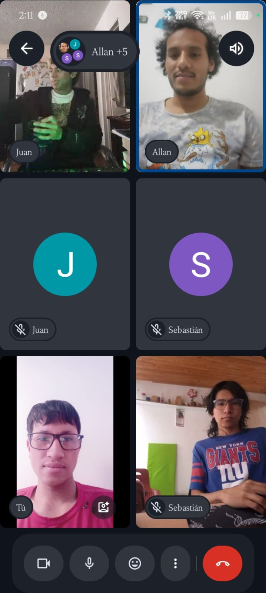
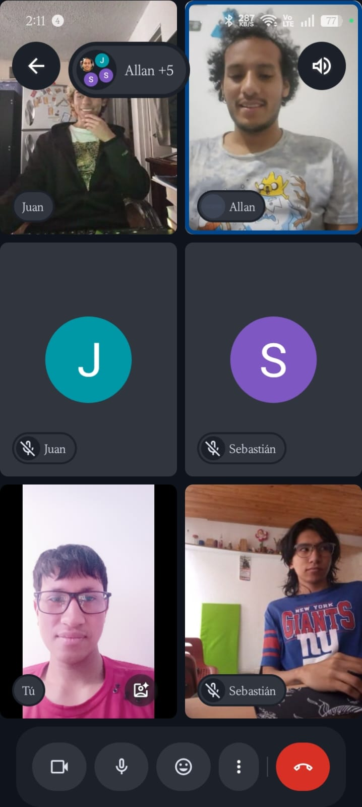
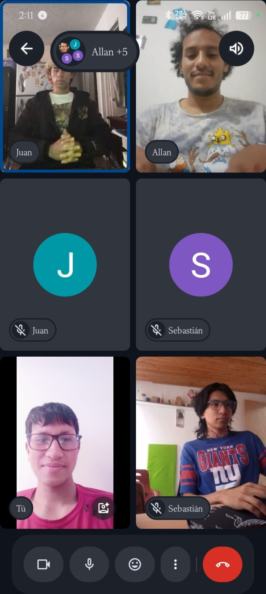
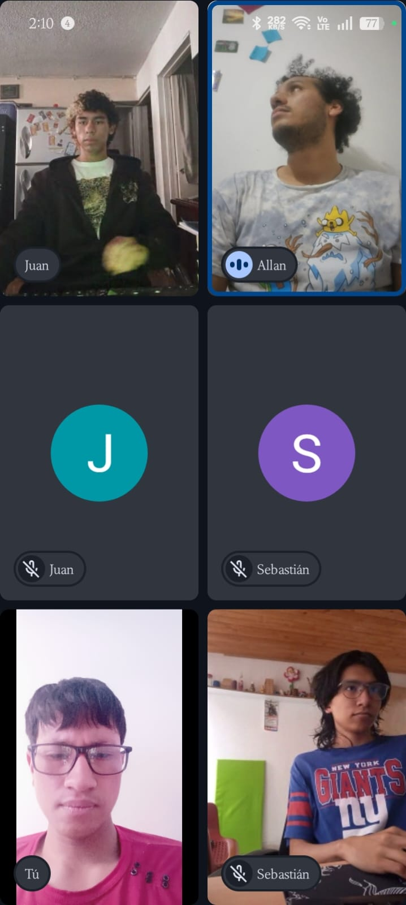
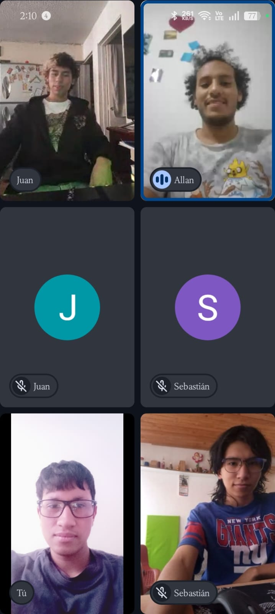

# Registro de Daily Scrum Meetings — Proyecto SignBridge

Este documento contiene el consolidado de las reuniones diarias (Daily Scrum) correspondientes al desarrollo del **Sprint 1 (Autenticación)**.

---

## Día 1
+   **Scrum Master:** Allan Benavides
+   **Hora de inicio:** 08:00 AM | **Hora de finalización:** 08:15 AM

| Aspecto | Allan Benavides | Sebastian Pachon | Javier Perez | Juan Soto |
| :--- | :--- | :--- | :--- | :--- |
| **¿Qué hice ayer?** | Revisé la documentación técnica de las interfaces de acceso y el modelo de datos base. | Analizó los requerimientos de la vista de autenticación y los flujos de navegación principal. | Estudió los requisitos del sistema de recuperación de accesos por correo. | Apoyé en la configuración inicial del entorno de desarrollo y priorización del tablero. |
| **¿Qué voy a hacer hoy?** | Iniciar con el maquetado visual del formulario de registro y la distribución de campos básicos. | Maquetar la interfaz limpia de la pantalla de inicio de sesión con sus respectivos campos. | Diseñar la estructura lógica del flujo para la solicitud del cambio de contraseña. | Configurar el repositorio del proyecto y estructurar las carpetas base de los módulos. |
| **¿Tengo algún bloqueo?** | Ninguno, los requerimientos de diseño están claros. | Requiero confirmar la paleta de colores final para la interfaz. | Ninguno. | Ninguno. |

  

---

## Día 2
+   **Scrum Master:** Javier Perez
+   **Hora de inicio:** 08:00 AM | **Hora de finalización:** 08:12 AM

| Aspecto | Allan Benavides | Sebastian Pachon | Javier Perez | Juan Soto |
| :--- | :--- | :--- | :--- | :--- |
| **¿Qué hice ayer?** | Avancé en la estructura HTML/CSS del formulario recopilando nombre, correo y contraseñas. | Completé el layout visual de la pantalla de Login y agregué el botón de acceso. | Grafiqué el flujo que seguirá el usuario al presionar la opción "Olvidé mi contraseña". | Revisé que las tareas en desarrollo correspondieran a las prioridades altas del sprint. |
| **¿Qué voy a hacer hoy?** | Desarrollar la lógica de validación para asegurar que las contraseñas tengan mínimo 8 caracteres y un número. | Programar la captura de datos (correo/password) y la validación interna de credenciales. | Maquetar la pantalla de recuperación donde el usuario ingresará su correo registrado. | Colaborar en las pruebas de adaptabilidad móvil (CSS responsive) en los layouts completados. |
| **¿Tengo algún bloqueo?** | Necesito validar si la alerta de contraseña débil se mostrará como un texto o un pop-up. | Ninguno, la lógica avanza según lo planeado. | Requiero definir la estructura del código de verificación que se enviará. | Ninguno. |

  

---

## Día 3
+   **Scrum Master:** Sebastian Pachon
+   **Hora de inicio:** 08:15 AM | **Hora de finalización:** 08:30 AM

| Aspecto | Allan | Sebastian Pachon | Javier Perez | Juan Soto |
| :--- | :--- | :--- | :--- | :--- |
| **¿Qué hice ayer?** | Implementé los bordes rojos de advertencia y las alertas para campos obligatorios vacíos. | Programó el mensaje de seguridad genérico de error cuando las credenciales no coinciden. | Desarrolló la interfaz para que el usuario reciba las instrucciones tras digitar su correo. | Ayudó a resolver un conflicto técnico con las expresiones regulares de validación de contraseñas. |
| **¿Qué voy a hacer hoy?** | Configurar la validación en base de datos para evitar que se registren correos duplicados. | Vincular la funcionalidad del botón de "Iniciar sesión" con el almacenamiento local de la sesión activa. | Iniciar con la programación del script que valida el código de verificación del usuario. | Realizar un control de calidad inicial en la interfaz de registro buscando inconsistencias de diseño. |
| **¿Tengo algún bloqueo?** | Ninguno por el momento. | Esperando la confirmación de la ruta de la pantalla principal para la redirección. | Ninguno. | Ninguno. |

  

---

## Día 4
+   **Scrum Master:** Juan Soto
+   **Hora de inicio:** 08:00 AM | **Hora de finalización:** 08:15 AM

| Aspecto | Allan | Sebastian Pachon | Javier Perez | Juan Soto |
| :--- | :--- | :--- | :--- | :--- |
| **¿Qué hice ayer?** | Integré la alerta interactiva que invita a iniciar sesión si el correo ya existe. | Añadió el direccionamiento automático hacia la pantalla principal tras un inicio de sesión exitoso. | Desarrolló la restricción que bloquea el proceso si no se completa la verificación de identidad. | Detecté algunos problemas de superposición visual en los botones al simular el modo celular. |
| **¿Qué voy a hacer hoy?** | Programar el evento final que redirige al usuario a la pantalla principal tras crearse su cuenta. | Realizar los últimos ajustes de estilos y asegurar que el estado de sesión persista adecuadamente. | Finalizar la lógica de actualización de la contraseña en la base de datos tras validar el código. | Consolidar la documentación del sprint y verificar el cumplimiento estricto de cada criterio de aceptación. |
| **¿Tengo algún bloqueo?** | Ninguno, el flujo está casi cerrado. | Ninguno. | Ninguno. | Ninguno. |

  

---

## Día 5
+   **Scrum Master:** Allan Benavides
+   **Hora de inicio:** 08:00 AM | **Hora de finalización:** 08:15 AM

| Aspecto | Allan | Sebastian Pachon | Javier Perez | Juan Soto |
| :--- | :--- | :--- | :--- | :--- |
| **¿Qué hice ayer?** | Unifiqué y testeé el flujo completo de registro (ingreso, validación de datos y redirección). | Concluyó las pruebas funcionales del login verificando la seguridad de los mensajes de error. | Completó las pruebas del flujo de recuperación de contraseña desde la solicitud hasta el cambio exitoso. | Ejecuté la revisión de diseño responsive final y el control de errores en los tres módulos. |
| **¿Qué voy a hacer hoy?** | Apoyar en la demostración del Sprint 1 para la entrega de la semana. | Realizar el despliegue del código limpio en la rama principal del repositorio. | Validar que no existan errores lógicos remanentes en las conexiones de la base de datos local. | Consolidar este documento de Daily Scrum, actualizar los estados del tablero a 'Completado' y cerrar el ciclo. |
| **¿Tengo algún bloqueo?** | Ninguno. Finalizamos el Sprint 1 de manera exitosa y a tiempo. | Ninguno. | Ninguno. | Ninguno. |

  

